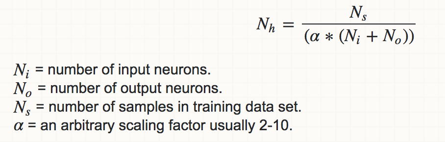

# Q & A

## What is the difference between a feed forward neural network and a convolution neural network?

Feed forward actually means how the network learns from the features, whereas a convolution neural network is type of neural network. For example, depending on how a convolution neural net learns, it can be named as a feed forward convolution neural network.

Feed forward means that a neuron from the layer close to the input layer (can be output layer if there is no hidden layer) get features values, applies to them weights and bias and uses an activation function to the result then send the results to the next layer, if there is no hidden layer then produces an output.

Convolution refers to the fact that from a dimension of an input you have, a filter is applied to it to take some of the interesting features from that dimension.

They both use back propagation for training the network.

## Training Artificial Neural Networks

The goal of the training phase is to learn the network's weights. We need 2 elements to train an artificial neural network:

- Training data: In the case of image classification, the training data is composed of images and the corresponding labels.
- Loss function: A function that measures the inaccuracy of predictions.

Once we have the 2 elements above, we train the ANN using an algorithm called backpropagation together with gradient descent (or one of its derivatives). For a detailed explanation of backpropagation, I recommend this [article](https://mattmazur.com/2015/03/17/a-step-by-step-backpropagation-example/).

## What are Convolutional Neural Networks?

Convolutional Neural Networks (ConvNets or CNNs) are a category of Neural Networks (special type of feed-forward networks) that have proven very effective in areas such as image recognition and classification. ConvNets have been successful in identifying faces, objects and traffic signs apart from powering vision in robots and self driving cars.

These models are designed to emulate the behaviour of a visual cortex. CNNs have special layers called convolutional layers and pooling layers that allow the network to encode certain images properties.

## Convolutional Neural Networks Architecture

The simplest architecture of a convolutional neural networks starts with an input layer (images) followed by a sequence of convolutional layers and pooling layers, and ends with fully-connected layers. The convolutional layers are usually followed by one layer of ReLU activation functions.

The convolutional, pooling and ReLU layers act as learnable features extractors, while the fully connected layers acts as a machine learning classifier. Furthermore, the early layers of the network encode generic patterns of the images, while later layers encode the details patterns of the images.

Note that only the convolutional layers and fully-connected layers have weights. These weights are learned in the training phase.

## What is Fully Connected Layer?

The Fully Connected layer is a traditional Multi Layer Perceptron that uses a softmax activation function in the output layer (other classifiers like SVM can also be used). The term “Fully Connected” implies that every neuron in the previous layer is connected to every neuron on the next layer.

Apart from classification, adding a fully-connected layer is also a (usually) cheap way of learning non-linear combinations of these features. Most of the features from convolutional and pooling layers may be good for the classification task, but combinations of those features might be even better.

## Why are images so often resized to 224 x 224?

In conventional cases, images are resized so that all images have the same size. In AlexNet, for example, during CNN training, all images are resized to 227 × 227  (or 224 × 224 in VGGNet) before being fed into the network. During testing, images are typically resized to 227 × 227 for feature extraction and classification ([Good Practice in CNN Feature Transfer, 2016](https://arxiv.org/pdf/1604.00133.pdf)).

## What is the difference between the Keras Functional API and the Sequential model?

The Functional API was designed to make it easier to build neural network models that are non-sequential. You use the sequential model if your model is simple and basically just a sequence of layers, and you use the Functional API to make more complex models, which includes non-sequential connections and multiple inputs/outputs (Matias Valdenegro, 2016).

I would add the recommendation to always use the functional form,even for purely sequential models. It is only slightly more verbose, and you can more easily adapt to multiple branches, inputs, or outputs. (David Menéndez Hurtado, 2016)

New neural network architectures at this time are moving away from such pattern (Matias Valdenegro, 2017).

## What does `padding='same'` do in `keras.layers.convolutional.Conv2D`?

This is the same as adding `ZeroPadding2D((1, 1))` before `Conv2D`. This layer can add rows and columns of zeros at the top, bottom, left and right side of an image tensor.

Default padding depends on the border mode and the kernel size.

## In Keras, what is a "dense" and a "dropout" layer?

Dropout is a regularization technique, which aims to reduce the complexity of the model with the goal to prevent overfitting.

The dense layer is fully connected layer, so all the neurons in a layer are connected to those in a next layer. Dense layer is used (as far as I understand) to use the activation functions on the input. See [activation functions](activation_functions.md) for more into.

## What is Data Augmentation?

Simply put, data augmentation just alters each batch of our images. It does this through flipping, slightly changing hues, stretching, shearing, rotation, etc. and it does this in ways that make sense. By that we mean, it wouldn't make sense to vertically flip an image of a dog for generalization purposes.

We want this to prevent model overfitting.

_Tip: Keras allows you to implement data augmentation fairly easily by creating a data-augmentation batch generator._

## What is Batch Normalization?

It is another good standard approach to reducing overfitting.

In general, the inputs to your neural network should always be normalized. Normalization **is a process where given a set of data, you subtract from each element the mean value for that data set and divide it by the data set's standard deviation**. By doing so, we put the input values onto the same "scale", in that all the values have been normalized into units of "# of standard deviations from the mean".

By default, you should always include batch normalization, and all modern neural networks do so because:

- Adding batchnorm to a model can result in 10x or more improvements in training speed.
- Because normalization greatly reduces the ability of a small number of outlying inputs to over-influence the training, it also tends to reduce overfitting.

## What is Transfer Learning?

Convolutional neural networks require large datasets and a lot of computional time to train. Some networks could take up to 2-3 weeks across multiple GPUs to train. Transfer learning is a very useful technique that tries to address both problems. Instead of training the network from scratch, transfer learning utilizes a trained model on a different dataset, and adapts it to the problem that we're trying to solve.

There are 2 strategies for transfer learning:

- Utilize the trained model as a fixed feature extractor: In this strategy, we remove the last fully connected layer from the trained model, we freeze the weights of the remaining layers, and we train a machine learning classifier on the output of the remaining layers.
- Fine-tune the trained model: In this strategy, we fine tune the trained model on the new dataset by continuing the backpropagation. We can either fine-tune the whole network or freeze some of its layers.

## What is one-hot vector?

Neural network based models like vector inputs. We, therefore, need to convert the integers into vectors.  A naive way of converting integers into vectors is to convert them into one-hot vectors – these are vectors where all of the values are set to zero, except for one i.e. [0, 0, 0, …, 1, …, 0, 0].  The “one-hot” value is located at the array index which matches the unique integer representation of the word. Therefore, our input one-hot vector must be at least the size of the vocabulary in length – i.e. > 10,000 words.

More info: https://machinelearningmastery.com/why-one-hot-encode-data-in-machine-learning/

## How to calculate the number of hidden nodes?

Use this formuila: 

Ref: https://stats.stackexchange.com/questions/181/how-to-choose-the-number-of-hidden-layers-and-nodes-in-a-feedforward-neural-netw